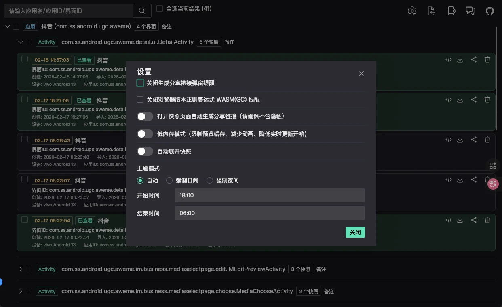

# GKD快照审查工具Plus
## 基于原版进行重构并增加一些功能

- 功能
  - [x] 快照树分类
  - [ ] 快照组备注
  - [x] 打开前预览快照图片
  - [x] 几乎完美支持**夜间模式**(99.8%)
  - [x] 搬入**测试选择器**至快照页
  - [x] 属性面板参数停留可显示解释
  - [x] 设置面板实现管理
  - [ ] 同web页内快照审查快速切换快照
  - [ ] 低内存模式
  - [ ] 国际化支持
- 优化
  - [x] 界面UI重构
  - [x] 点过快照标记**已查看**并有绿色遮罩
  - [ ] 快照图片时间戳难以辨识
  - [x] 小放大图坐标难以辨识

## 功能演示

### 快照图片预览 & 快照树分类 & UI重构

#### 白天

<video src="./images/00_Snap-tree-demo.mp4" controls autoplay loop muted width="80%"></video>

https://github.com/user-attachments/assets/079a48b0-aca8-46bb-95cf-589b08d7b546

#### 夜间
<video src="./images/01_Snap-tree-demo-dark.mp4" controls autoplay loop muted width="80%"></video>

https://github.com/user-attachments/assets/3f97bf89-3e9f-4369-b080-d70049969b05

  
示例: 审查快照-搬入 测试选择器

<video src="./images/02_Snap-tools.mp4" controls autoplay loop muted width="100%"></video>
  
https://github.com/user-attachments/assets/7724a546-7722-4964-8f17-b55591fcef63

  
示例: 属性面板参数停留2s可显示解释

<video src="./images/03_Property-Panel_Tip.mp4" controls autoplay loop muted width="100%"></video>
  
https://github.com/user-attachments/assets/4127ae50-b1a1-4714-b314-3844c06a2890

  
示例: 选择器路径视图 白/夜 显示

<video src="./images/04_Drak_sport.mp4" controls autoplay loop muted width="100%"></video>
  
https://github.com/user-attachments/assets/f0c85372-7176-4530-b379-6f573e600f9a

### 设置面板

#### 你可以在里面自定义想要的喜好设置

  
示例: 实时执行点击选择器

## 快照示例

- <https://i.gkd.li/i/14045424>
- <https://i.gkd.li/i/14039510>
- <https://i.gkd.li/i/14035418>
- <https://i.gkd.li/i/14034770>
- <https://i.gkd.li/i/14031920>
- <https://i.gkd.li/i/14018243>
- <https://i.gkd.li/i/14011298>
- <https://i.gkd.li/i/13999908>

## 🎉感谢以下项目

- [gkd-kit/inspect](https://github.com/gkd-kit/inspect) 原项目

## 🥇感谢以下开发者的贡献

- [CodeX](https://chatgpt.com/codex)

## 📈Star History

