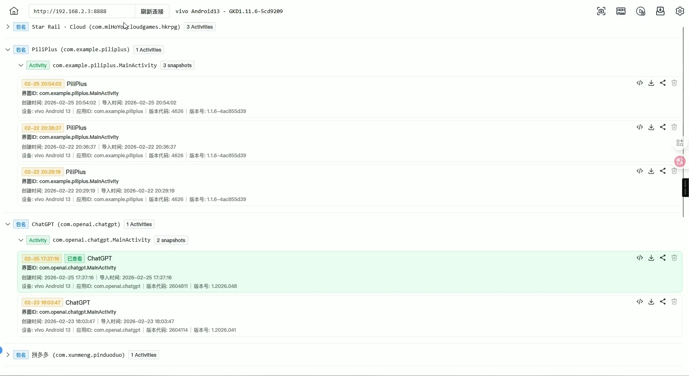
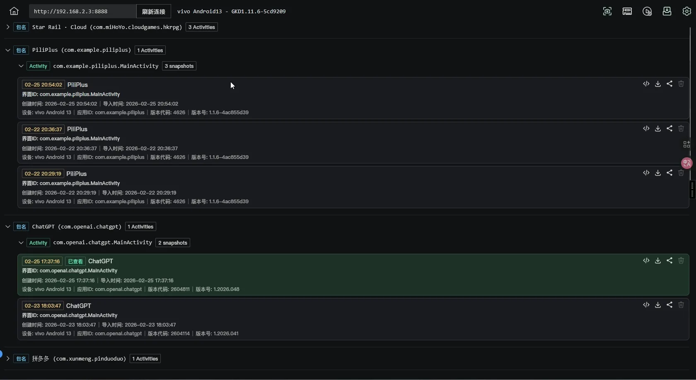
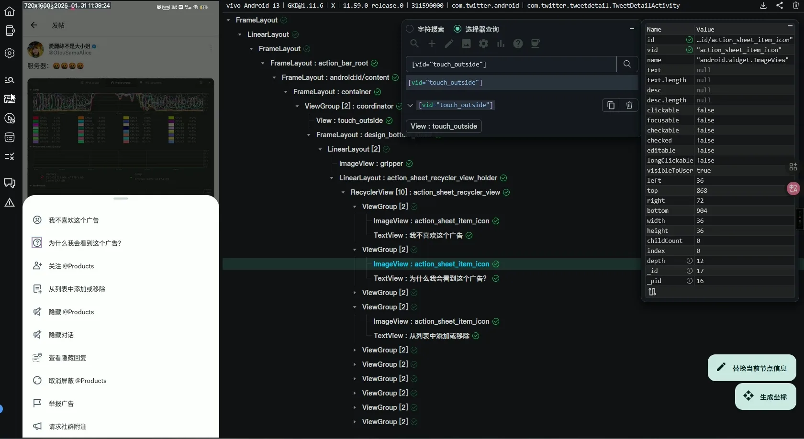
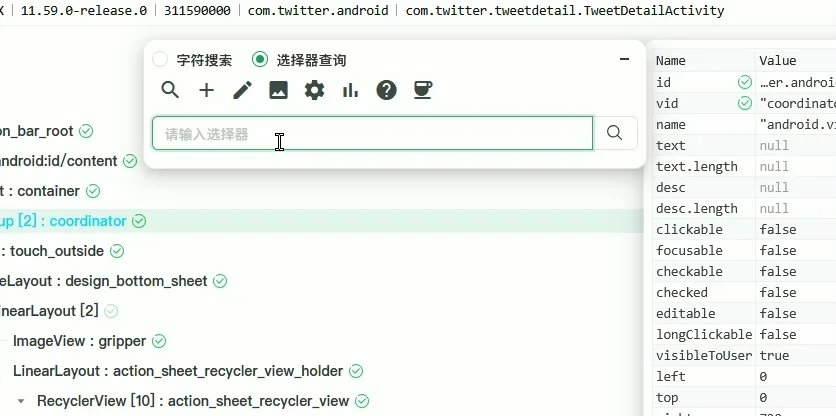
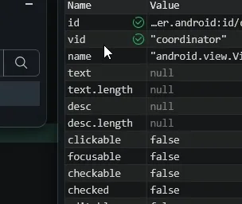
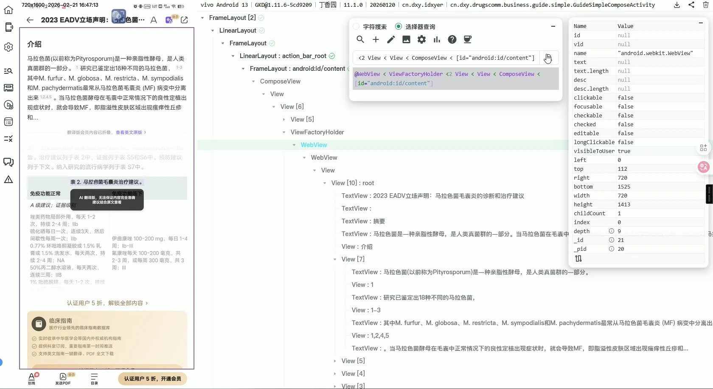
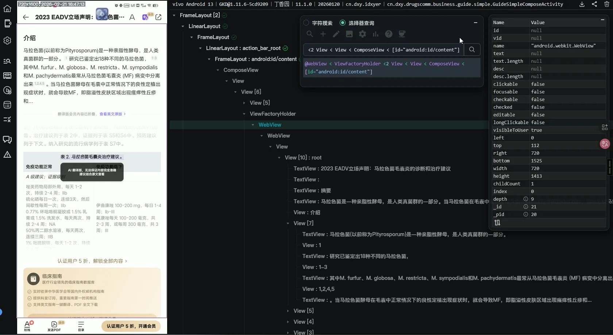

# GKD快照审查工具Plus
#### 基于原版进行重构并增加一些功能与优化，以改善体验为主为目的，使用ai进行改造的项目，可能会有~~些许bug~~,欢迎指正~

## 功能演示

### 快速预览 & 快照树分类 & UI重构

### 白天/夜间模式

  <table border="0">
    <tr>
      <td align="center" style="border: none;">
        <b>☀️ 日间模式</b> 
        
        
      </td>
      <td align="center" style="border: none;">
        <b>🌚 夜间模式</b> 
        
        
      </td>
    </tr>
  </table>

### 快照审查页-多种工具供你快速调用

### 选择器实时语法检查

### 属性面板参数用途提示

### 选择器路径视图UI无缝切换

  <table border="0">
    <tr>
      <td align="center" style="border: none;">
        <b>☀️ 日间模式</b> 
        
      </td>
      <td align="center" style="border: none;">
        <b>🌚 夜间模式</b> 
        
      </td>
    </tr>
  </table>

### 设置面板

#### 你可以在里面自定义想要的喜好设置

  
示例: 实时执行点击选择器

## 使用方法

### 需要使用重定向域名脚本把官方域名重定向至本项目的域名，否则无法实现无感切换，脚本源代码在本项目的[userscripts](./userscripts/url-redirect.user.js)目录下。

1. 安装[油猴脚本管理器](https://www.tampermonkey.net/index.php?browser=chrome&locale=zh)扩展。
2. 点击[这里](https://github.com/cjy0812/inspect-plus/raw/refs/heads/main/userscripts/url-redirect.user.js)打开脚本安装页面，点击安装。
3. 刷新GKD快照审查工具页面，即可重定向生效。

#### 目前MIKU增强脚本已添加本项目作用域可直接使用

## 快照示例

- <https://i.gkd.li/i/14045424>
- <https://i.gkd.li/i/14039510>
- <https://i.gkd.li/i/14035418>
- <https://i.gkd.li/i/14034770>
- <https://i.gkd.li/i/14031920>
- <https://li.chenge.eu.org/i/14018243>
- <https://li.chenge.eu.org/i/14011298>
- <https://li.chenge.eu.org/i/13999908>

## 项目进度

- 功能
  - [x] 快照树分类
  - [ ] 快照组备注(40%)
  - [x] 更好的节点树快查显示方式
  - [x] 打开前预览快照图片
  - [x] 几乎~~完美~~支持夜间模式(99.8%)
  - [x] `测试选择器`至快照页与搜索面板合并
  - [x] `执行选择器` `修改内存订阅` 至快照审查页
  - [ ] 更强大的`内存订阅管理器`(0%)
  - [x] 属性面板参数停留可显示解释
  - [x] 设置面板实现管理
  - [ ] 同web页内快照审查快速切换快照(0%)
  - [x] 快查节点特殊颜色标记
  - [ ] 低内存模式(20%)
  - [ ] 国际化支持(0%)
  - [ ] 删除手机端快照管理(0%)
  - [ ] 截图快速编辑打马赛克
- 优化
  - [x] 界面样式UI重构优化
  - [x] 完善图标
  - [x] 点过快照标记**已查看**并有绿色遮罩
  - [x] 快照图片时间戳难以辨识
  - [x] 小放大图坐标难以辨识
  - [x] 选择器查询输入框支持自动换行
  - [ ] 选择器查询支持matches数组(60%)
  - [ ] 支持查询参数可接受多个(0%)
  - [x] 复制类名直接简写本身
  - [x] 第6种关系操作符 -> 渲染崩溃

## 在线部署指南

[查看在线部署指南](./docs/structure.md/#在线部署指南)

## 源码运行

[查看源码运行指南](./docs/structure.md)

## 🎉感谢以下项目

- [gkd-kit/inspect](https://github.com/gkd-kit/inspect) 原项目

## 🥇感谢以下开发者的贡献

- [CodeX](https://chatgpt.com/codex) AI高阶构思项目
- [Trae](https:///www.trae.ai) AI重复性劳动
- [Gemini](https://gemini.google.com/) AI辅助指导
- [deepSeek](https://chat.deepseek.com/) 提供代码解释帮助
- [Doubao-Seed-Code] 自动化指令操作执行

## 📈Star History

